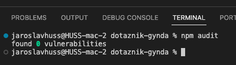

# O aplikaci

Aplikace sbírá a zobrazuje data o stavu pacientů.

## Požadavky před instalací

1. Pro instalaci je potřeba mít nainstalovaný [Node.js](https://nodejs.org/en/)
2. Aplikace používá dokumentovou databázi MongoDB. MongoDB lze mít nainstalovaný lokálně (https://www.mongodb.com/docs/manual/installation/) nebo pomocí Dockeru (https://hub.docker.com/_/mongo/)
3. [Dobrovolné] Pro instalaci je potřeba mít nainstalovaný [Git](https://git-scm.com/downloads)
4. [Dobrovolné] Pro instalaci je potřeba mít nainstalovaný [PM2](https://pm2.keymetrics.io/)

## Instalace

1. Stáhněte si zdrojové kódy pomocí `git clone https://github.com/jaroslavhuss/healthtracker` nebo si stáhněte zip soubor z [Repozitáře](https://github.com/jaroslavhuss/healthtracker)
2. Přejděte do složky /apps/settings a zde vytvořte soubor .env s následujícím obsahem:

```bash
JWT_SECRET = 5f4dcc3b5aa765d61d8327deb882cf99 # Toto je pouze příklad, prosím změňte hodnotu
JWT_REFRESH_SECRET = 5f4dcc3b5aa765d61d8327deb882cf99 # Toto je pouze příklad, prosím změňte hodnotu
JWT_EXPIRE = 120min # Zde můžete nastavit, jak dlouho zůstane uživatel přihlášený
JWT_EXPIRE_REFRESH = 7d # Zde můžete nastavit, jak dlouho zůstane uživatel přihlášený po obnovení tokenu
DATABASE_URL = mongodb://localhost:27017/myoms # Zde můžete nastavit URL pro připojení k MongoDB, jedná se o příklad a je potřeba nastavit silné heslo
PORT = 5006 # Zde můžete nastavit port, na kterém bude aplikace běžet. Defaultně bude aplikace dostupná na http://localhost:5006
```

Berte prosím za nesmírně důležité změnu hodnot u JWT_SECRET a JWT_REFRESH_SECRET. Tyto hodnoty jsou použity pro šifrování a dešifrování JWT tokenů. Hodnoty můžete vygenerovat pomocí `openssl rand -hex 40`.

3. Vraťte se zpět do kořenové složky a aplikaci sestavte pomocí `npm run full`

- Pokud se vyskytnou nějaké potíže s `npm run full`, postupujte následovně:
  - `npm run installation`
  - `npm run build`
  - `npm run finish`

4. Přejděte do složky se sestavenou aplikací `cd ./apps/api/dist/src`
5. Spusťte aplikaci pomocí `node main.js` nebo ideální pomocí [PM2](https://pm2.keymetrics.io/) - `pm2 start main.js --name healthtracker:5006`

## Pokud se vyskytnou problémy

Pokud se vyskytnou problémy, můžete vytvořit issue v tomto repozitáři. Také mě můžete kontaktovat na emailu jaroslav.huss@gmail.com

## npm audit

Závislosti aplikace jsou zkontrolovány pomocí `npm audit`. Výsledek kontroly je na obrázku níže.


## Jak aplikaci aktualizovat

1. Stáhněte poslední aktulizace pomocí `git pull`.
2. Aplikaci opět sestavte pomocí `npm run full`.
3. Pokud používáte [PM2](https://pm2.keymetrics.io/), restartujte aplikaci pomocí `pm2 restart healthtracker:5006`.
4. Pokud nepoužíváte [PM2](https://pm2.keymetrics.io/), restartujte aplikaci pomocí `node main.js`.

## Licence

MIT Licence

Tento software a přidružené dokumentační soubory (dále jen "Software") jsou poskytovány zdarma každé osobě, která získá kopii tohoto softwaru a přidružených dokumentačních souborů, za podmínek uvedených níže:

Je povoleno používat, kopírovat, upravovat, slučovat, publikovat, distribuovat, sublicencovat a/nebo prodávat kopie tohoto softwaru a povoleno je také povolit osobám, kterým je Software poskytnut, aby tak činily, za předpokladu, že následující podmínky jsou splněny:

Všechny kopie nebo podstatné části tohoto softwaru musí obsahovat výše uvedené autorská práva a toto povolení.

SOFTWARE JE POSKYTOVÁN "TAK JAK JE", BEZ ZÁRUKY JAKÉHOKOLIV DRUHU, VÝSLOVNÉ NEBO PŘEDPOKLÁDANÉ, VČETNĚ, ALE NEJEN, ZÁRUKY OBCHODOVATELNOSTI, VHODNOSTI PRO URČITÝ ÚČEL A NEPORUŠOVÁNÍ AUTORSKÝCH PRÁV. V ŽÁDNÉM PŘÍPADĚ NEBUDE AUTOR NEBO DRŽITEL AUTORSKÝCH PRÁV ODPOVĚDNÝ ZA JAKÉKOLIV NÁROKY, ŠKODY NEBO JINOU ODPOVĚDNOST, BUĎTO V DŮSLEDKU SMLUVNÍHO VZTAHU, DELIKTU NEBO JINAK, VYPLÝVAJÍCÍ Z, NEBO V SOUVISLOSTI S SOFTWAREM NEBO POUŽÍVÁNÍM NEBO JINÝMI ČINNOSTMI V SOUVISLOSTI S SOFTWAREM.

---

MIT License

Permission is hereby granted, free of charge, to any person obtaining a copy of this software and associated documentation files (the "Software"), to deal in the Software without restriction, including without limitation the rights to use, copy, modify, merge, publish, distribute, sublicense, and/or sell copies of the Software, and to permit persons to whom the Software is furnished to do so, subject to the following conditions:

The above copyright notice and this permission notice shall be included in all copies or substantial portions of the Software.

THE SOFTWARE IS PROVIDED "AS IS", WITHOUT WARRANTY OF ANY KIND, EXPRESS OR IMPLIED, INCLUDING BUT NOT LIMITED TO THE WARRANTIES OF MERCHANTABILITY, FITNESS FOR A PARTICULAR PURPOSE AND NONINFRINGEMENT. IN NO EVENT SHALL THE AUTHORS OR COPYRIGHT HOLDERS BE LIABLE FOR ANY CLAIM, DAMAGES OR OTHER LIABILITY, WHETHER IN AN ACTION OF CONTRACT, TORT OR OTHERWISE, ARISING FROM, OUT OF OR IN CONNECTION WITH THE SOFTWARE OR THE USE OR OTHER DEALINGS IN THE SOFTWARE.
